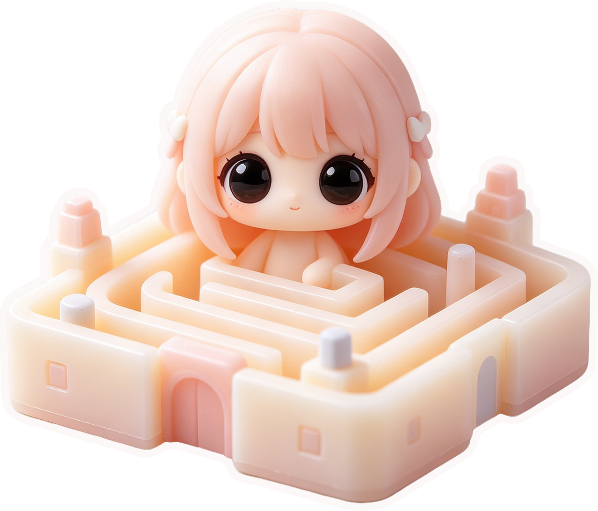

<p align="center">
  
</p>

<div align="center">

# 🧩 Maze

**✦ 一款可以随机生成迷宫的游戏软件 ✦**

[](https://github.com/MonoKelvin/Maze)
[](https://github.com/MonoKelvin/Maze)
[](https://www.electronjs.org/)
[](https://vuejs.org/)
[](https://www.typescriptlang.org/)
[](https://vitejs.dev/)

</div>

> 🤖 **本项目 100% 由 AI 编码完成。** 所有代码、文档与资源均由 [**Claude Code**](https://claude.ai/code)、[**Cursor**](https://cursor.com) 及 **豆包** 等 AI 工具协同生成；开发者负责提需求、审代码、按确认。真正做到了一行代码都不写，只负责喝咖啡和验收 (￣▽￣)\*~
>
> **郑重声明：** 本项目仅供学习与非商业使用。素材可能涉及第三方版权，商业使用及由此产生的法律责任由使用者自行承担。

---

> 🎯 **用键盘在迷宫中穿梭，从入口走到出口即是胜利。** 每次打开都是全新的迷宫。

## 📖 这是什么？

Maze 是一个安装在电脑上的**桌面迷宫游戏**。它每次生成一个独一无二的完美迷宫（保证有解），你使用键盘的 **方向键** 或 **W/A/S/D** 控制角色，从入口走到出口即是胜利。

🧭 迷路了吗？可以一键显示**最短路径**。🖱 鼠标滚轮缩放、拖拽平移，从任意角度观察迷宫。

<p align="center">
  
</p>

| 支持 | 说明 |
|------|------|
| 📐 尺寸 | 1×1 ~ 200×200，任意调节 |
| 🎨 主题 | 深色、暖色、海洋、森林、紫色 |
| ⚡ 性能 | 200×200 毫秒级生成，60fps 动画 |
| 💾 记忆 | 自动保存窗口位置和大小 |

## 🚀 快速上手

```bash
# 1. 安装依赖
npm install

# 2. 启动玩耍 (:
npm run dev

# 3. 桌面窗口运行
npm run electron:dev

# 4. 打包安装程序
npm run package
```

## 🎮 怎么玩

| 操作 | 按键 |
|------|:----:|
| ⬆️ 上 / ⬇️ 下 / ⬅️ 左 / ➡️ 右 | `↑↓←→` 或 `W A S D` |
| 🔍 缩放 | 鼠标滚轮 |
| ✋ 平移 | 按住鼠标拖拽 |
| 👁 最短路径 | 点击「显示路径」或按 `P` |
| 🔄 新迷宫 | 点击「重新生成」或按 `G` |
| 📍 回起点 | 点击「重置位置」或按 `R` |
| ℹ️ 快捷键 | 左上角 `?` 图标 |

> 💡 **小提示**：按住方向键可以连续移动，中途换向会立刻响应。到达出口会自动弹出胜利弹窗 🎉

## 🎛 右侧面板

| 区域 | 功能 |
|------|------|
| ⏱ **状态** | 实时显示用时和步数 |
| 👤 **角色** | 选择形状、图标、自定义图片和大小 |
| 📏 **尺寸** | 调整行/列数（1~200），**点击数字直接输入** |
| ⚡ **速度** | 1~10 档移动速度 |
| 🔧 **操作** | 重新生成、重置位置、显示/隐藏路径 |
| 🎨 **主题** | 5 种配色一键切换 |

---

## 🛠 给开发者的

### 📦 技术栈

```
Electron  ───  桌面窗口 & IPC
    │
Vue 3 + TS  ──  界面 & 类型安全
    │
 Pinia 2    ──  状态管理
    │
Canvas 2D  ──  迷宫渲染 (60fps)
    │
Lucide Vue ──  图标
```

### 🗂 项目结构

```
Maze/
├── electron/           # 主进程（窗口、IPC）
├── src/
│   ├── views/          # 📄 GameView — 核心游戏视图
│   ├── components/     # 🧩 WindowTitleBar / ThemeSwitcher / VictoryModal …
│   ├── store/          # 📊 Pinia 状态
│   ├── utils/          # ⚙️ 生成 / 渲染 / 碰撞 / 求解
│   ├── types/          # 📝 TypeScript 类型
│   └── constants/      # 🎨 主题 & 配置
├── doc/                # 📚 文档
└── tests/              # ✅ 测试
```

### ⚡ 关键设计

- **🏗 迷宫** — `Uint8Array` 位掩码，不创建 Cell 对象，200×200 毫秒级生成
- **🌀 算法** — 递归回溯（迭代 + 栈），大迷宫异步分片，支持取消
- **🖌 渲染** — 动态线宽算法，`cs × 0.16` 等比缩放，上限 4px；大迷宫细线不重叠
- **🧨 碰撞** — 读位掩码 O(1) 判断
- **🗺 求解** — BFS 最短路径
- **🔍 缩放** — `×1.1` 等比缩放，每档 ±10%，手感恒定
- **🎨 主题** — CSS 变量动态切换，全组件响应

### 🔧 常用命令

```bash
npm run dev              # 启动开发
npm run type-check       # TS 类型检查
npm run test:unit        # 单元测试
npm run lint             # ESLint
npm run format           # Prettier
npm run package          # 打包安装程序
```

---

<p align="center">
  
  
</p>

---

## ☕ 赞助支持

如果这个项目对你有所帮助，欢迎请我喝杯咖啡，支持我买点 token 继续喂 AI (｡•̀ᴗ-)✧

<p align="center">
  <table align="center">
    <tr>
      <td align="center"><b>支付宝</b></td>
      <td align="center"><b>微信支付</b></td>
    </tr>
    <tr>
      <td></td>
      <td></td>
    </tr>
  </table>
</p>

---

<div align="center">

## 📄 MIT License

**MonoKelvin** · [GitHub](https://github.com/MonoKelvin/Maze)

───

(｡◕‿◕｡) **100% AI Coded · Zero Manual Typing** ✨

</div>
